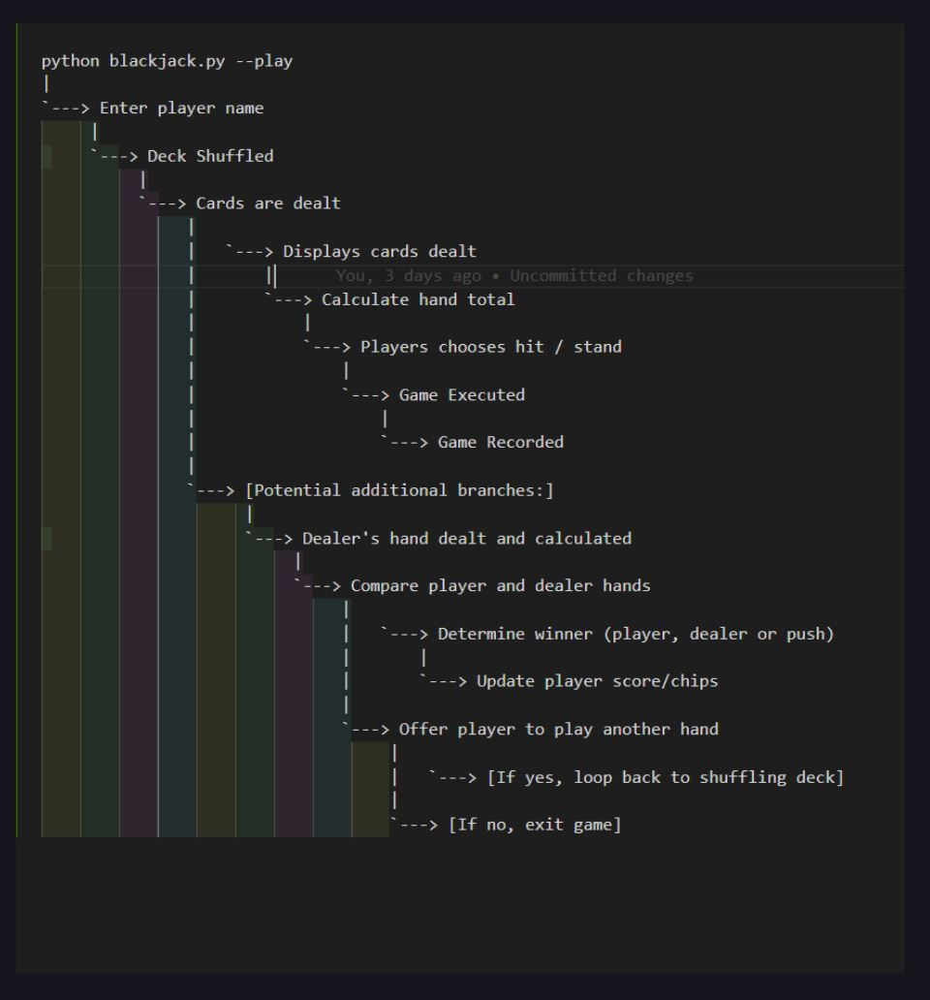
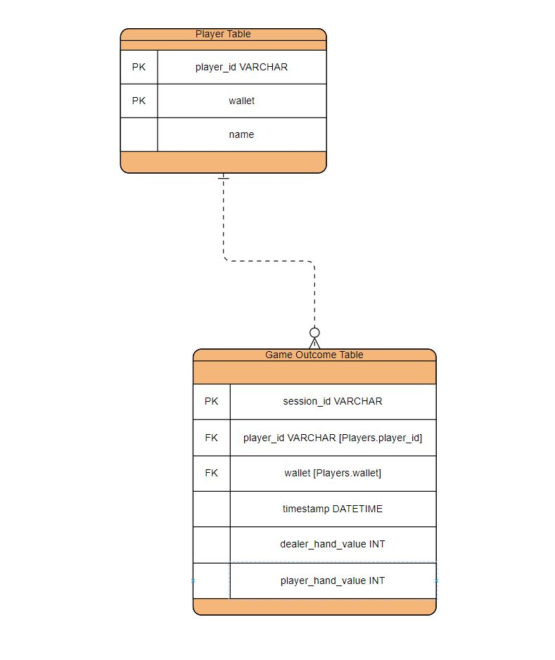
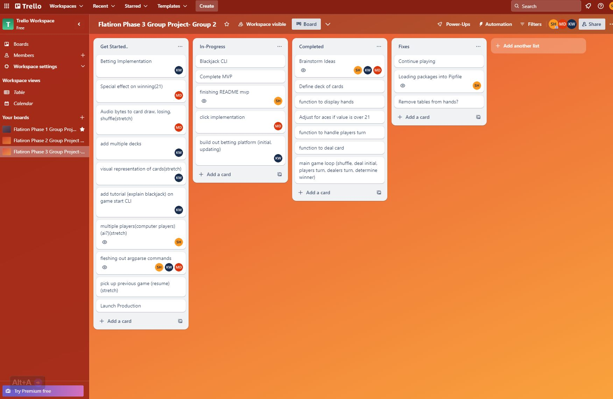

# CLI Blackjack

## Description
Blackjack CLI is a command-line interface application that lets you experience the thrill of the classic casino card game right from your terminal. Engage in a challenging game against a computerized dealer and test your strategy and luck.

## 🚀 Usage
To start type command below in user-terminal; type play; enter player name; begin.
>python blackjack.py

Follow the on-screen prompts to enter your **player** name and **play** the game. You can choose to **hit** or **stand** on your turn. The game will display the outcome (win, loss, or tie) after each round.
To view past game outcomes, enter **'view'** at the main menu. To quit the game, enter **'quit'**.

Use openai version 0.27
>pip install openai==0.27

## ⚙️ Technologies / Libraries Include:
1. Python: The core language used for development.
2. Rich: Provides enhanced CLI formatting.
3. Prompt Toolkit: Facilitates interactive command-line prompts.
4. Click: Simplifies CLI creation.
5. SQLAlchemy: Manages database interactions.
6. Argparse: Adds helpful command-line options.
7. Pygame: Audio mixer usage.
8. OpenAI: Powerful AI text generation ( GPT-3.5 )
9. Typing: Type hints for Python

## 🎲 Deliverables: 
> (User Stories):
* Real-Time Decisions: Choose to "hit" or "stand" on your turn and watch as the game unfolds in real time.
* Player draw
* Dealer draw
* Randomize card draw
* Shuffle deck
* Reset deck
* Game End Conditions: The game automatically concludes if your card total exceeds 21.
* Ace Handling: Choose whether an Ace holds a value of 1 or 11, based on your strategy.
* Dealer Rules: Dealer hits below 16 and stands on 17 or above.
* Replayability: After each round, decide if you want to play again with just a simple command.
* Tracking player wins (incomplete)
* Username input
* Determine winner
* Integrate betting system
* Fleshing out argparse commands

## 🌟 Stretch Deliverables: 
> (Future Enhancements):
* Implement multiplayer functionality (computer)
* ai implementation (help suggestions)
* Special effect on winning (21)
* Add special effects and audio for winning hands
* Support multiple decks
* Implement resume game feature
* Visual representation of cards
* Enhance ASCII art card representations
* Migrate to SQLAlchemy for database management.

## Database Schema
>Database Schema

The application uses a SQLAlchemy database ( blackjack.db) to store player information and game outcomes. The database contains two tables:
players: Stores player ID and name
game_sessions: Stores game outcomes with player ID, dealer and player hand values, and outcome (win/loss/tie)

## 🗺️ Decision Tree
>A decision tree of the flow of your CLI.  

## 🗺️ Diagram
> Diagram of database including relationships, constraints, intended CRUD actions

## 🗺️ Trello Board
>A kanban board showing how you will be dividing tasks among partners

## 🤝 Meet the Team

* Shukri Hussein 🔗[GitHub Profile Link](https://github.com/scmh001) 🔗 [LinkedIn Link](https://www.linkedin.com/in/shukrihussein/)
* Keenan Weise 🔗[GitHub Profile Link](https://github.com/kcweise) 🔗[LinkedIn Link](https://www.linkedin.com/in/keenan-weise/)
* Michael DiPasquale 🔗[GitHub Profile Link](https://github.com/mdipasqu13) 🔗[LinkedIn Link](https://www.linkedin.com/in/michael-dipasquale313/)

## 🙌 Acknowledgements
* The project was inspired by the classic game of Blackjack.
* Special thanks to the open-source community for their valuable libraries and resources.