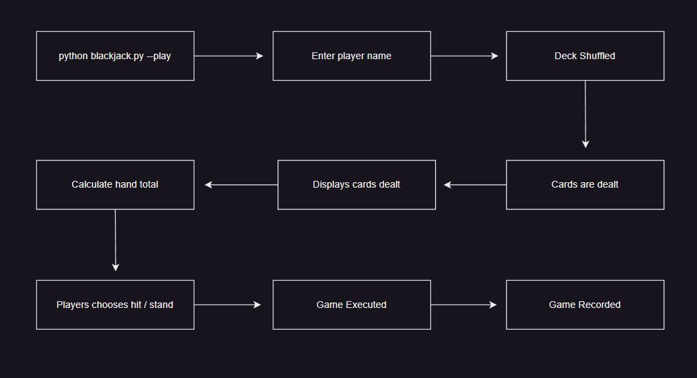
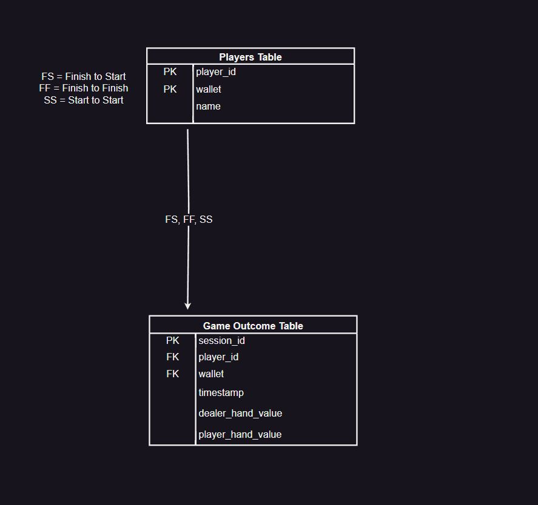

# CLI Blackjack

## Description
This is a command-line interface (CLI) application that allows users to try their hand at the classic casino game of Blackjack.

## Instructions
To start type above command; enter player name; begin.
>python blackjack.py --play

To view scores:
>python blackjack.py --view

**Libraries Include:**
1. rich
2. prompt_toolkit
3. click
4. argparse
5. random
6. sqlite3

## Deliverables (User Stories)
> As a user I can:
* player draw
* dealer draw
* randomize card draw
* shuffle deck
* reset deck
* over 21 ends game
* ace = 1 or 11
* dealer must hit below value 16
* stand on value 17
* ask to play again (fix)
* counting player wins (incomplete)
* username input
* determine winner
* betting (keenan)
* fleshing out argparse commands

## Stretch Deliverables
> As a user I can:
* multiple players
* Special effect on winning(21)
* audio bytes to card on - draw, shuffle, losing
* click integration
* add multiple decks
* visual representation of cards
* ai implementation (multiple players)
* pick up previous game (resume)

## Decision Tree
>A decision tree of the flow of your CLI.  

## Diagram
> Diagram of database including relationships, constraints, intended CRUD actions

## Trello Board
>A kanban board showing how you will be dividing tasks among partners

