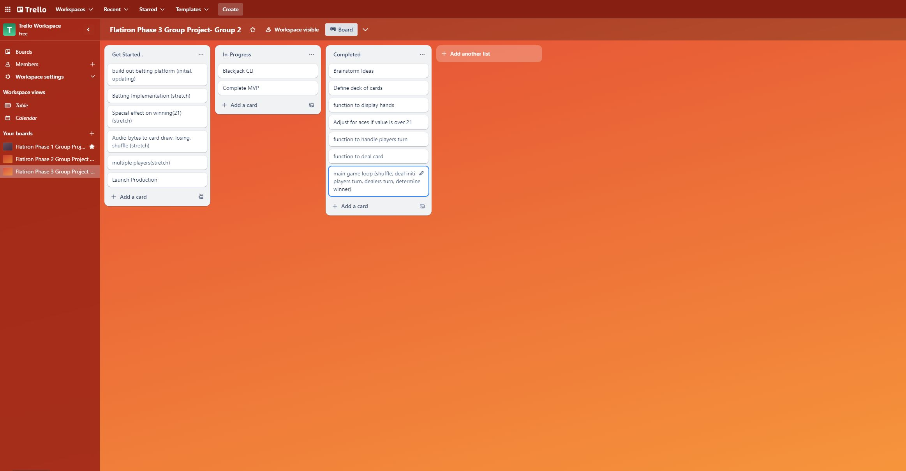

# CLI Blackjack

## Description
This is a command-line interface (CLI) application that allows users to try their hand at the classic casino game of Blackjack.

## Insctructions
To start type above command; enter player name; begin.
>python blackjack.py --play

To view scores:
>python blackjack.py --view

## Deliverables
> As a user I can:
* player draw
* dealer draw
* randomize card draw
* shuffle deck
* reset deck
* over 21 ends game
* ace = 1 or 11
* dealer must hit below value 16
* stand on value 17
* ask to play again
* counting player wins
* username input
* determine winner

## Stretch Deliverables
> As a user I can:
* multiple players
* betting
* Special effect on winning(21)
* audio bytes to card on - draw, shuffle, losing

## Decision Tree

## Diagram
> Diagram of database including relationships, constraints, intended CRUD actions

## Trello Board
>A kanban board showing how you will be dividing tasks among partners
